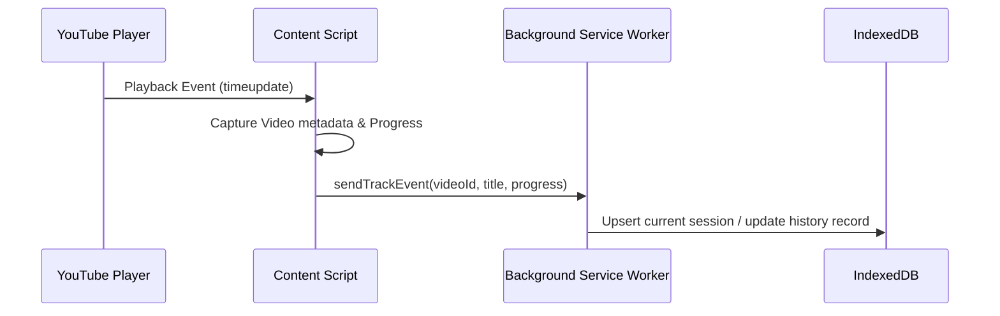
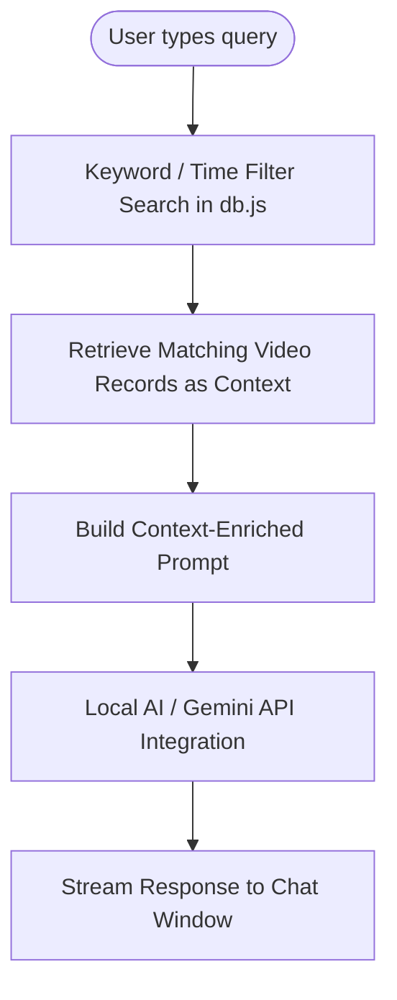

# RewindAI 🕒

**RewindAI** is a privacy-first, locally-hosted Chrome extension designed to automatically capture, index, and visualize your YouTube watch history. Equipped with a local **Retrieval-Augmented Generation (RAG)** chatbot inside the browser's side panel, it allows you to privately chat with your watch history and query past video details using natural language.

All processes, storage, and models run entirely within your local browser sandbox—making it 100% private, offline-capable, and secure.

---

## 🌟 Key Features

- 🔒 **100% Privacy & Local Storage**
  Your viewing habits are yours alone. All watch logs, time trackers, and video metadata are captured and indexed inside your browser's **IndexedDB**. No external servers, API aggregators, or telemetry trackers are used.
- 🤖 **Context-Aware AI Chat Side Panel (Local RAG)**
  Interact with your personal watch history in natural language. Powered by an integrated browser-native LLM or API, the chatbot retrieves relevant video metadata and uses it to answer complex queries (e.g., *"Show me the DevOps tutorials I watched last Thursday,"* or *"What was the channel name of that cooking video I closed halfway?"*).
- 📊 **Rich Analytics Dashboard**
  A premium, visually-stunning dark-mode dashboard providing:
    - **Full-Text Keyword Search**: Instantly filter through titles, descriptions, and channel tags.
    - **Visual Statistics**: Beautiful interactive charts summarizing daily watch time, top-visited channels, and category distributions.
    - **Data Control Panels**: Easily prune search logs, delete specific records, or export the entire history database as a single portable JSON file.
- ⏱️ **Automatic Active Tracking**
  A high-accuracy background tracking script monitors YouTube players, calculates exact passive/active watch duration, and records real-time playback milestones (e.g., when you hit 25%, 50%, 75%, or 100% of a video).

---

## 🛠️ File Architecture

The codebase is organized into modular components that coordinate the tracking, storage, and retrieval flows:

- **`manifest.json`**: Configured using Chrome Extension Manifest V3. Defines side panel defaults, service workers, and host permissions for YouTube tabs.
- **`db.js`**: Core database service layer. Initializes IndexedDB schemas (such as stores for `videos`, `sessions`, and `queries`) and implements key-value search mechanics, analytics aggregation queries, and metadata mapping interfaces.
- **`content.js`**: Content script injected into YouTube page DOMs. Observes page navigations, parses player details (video ID, duration, channel name, category metadata), monitors playback state transitions, and sends focus status payloads back to the service worker.
- **`background.js`**: The central background service worker. Manages tab events, coordinates data serialization pipelines, handles updates when tabs are closed, and bridges messages between the dashboard, side panel, and content scripts.
- **`sidepanel.html` / `.css` / `.js`**: RAG-enabled chatbot assistant layout. Hosts the chat conversation window, processes retrieval queries from IndexedDB, appends relevant context to LLM prompts, and manages streaming response flows.
- **`dashboard.html`**: A full-scale dashboard layout with modern typography, smooth color gradients, statistics cards, and canvas-based analytics charts.

---

## 🔄 Technical Flow: Under the Hood

### 1. The Tracking Loop


### 2. Local RAG Pipeline


---

## 🚀 Quick Start & Installation

To load and use this extension locally:

1. **Clone or Download** this repository to your computer.
2. Open Google Chrome and type the following into your address bar:
   ```text
   chrome://extensions/
   ```
3. Toggle the **Developer mode** switch in the top-right corner to **ON**.
4. Click the **Load unpacked** button in the top-left corner.
5. Choose the folder where you saved this repository (the directory containing `manifest.json`).
6. **Pin the extension** from the extensions puzzle icon.
   - Click the extension icon to launch the **Analytics Dashboard**.
   - Navigate to YouTube and open the Chrome **Side Panel** dropdown to use the **AI Assistant**.

---

## 🛡️ License

This project is open-source under the [MIT License](LICENSE). Feel free to customize, modify, and build upon it locally!
